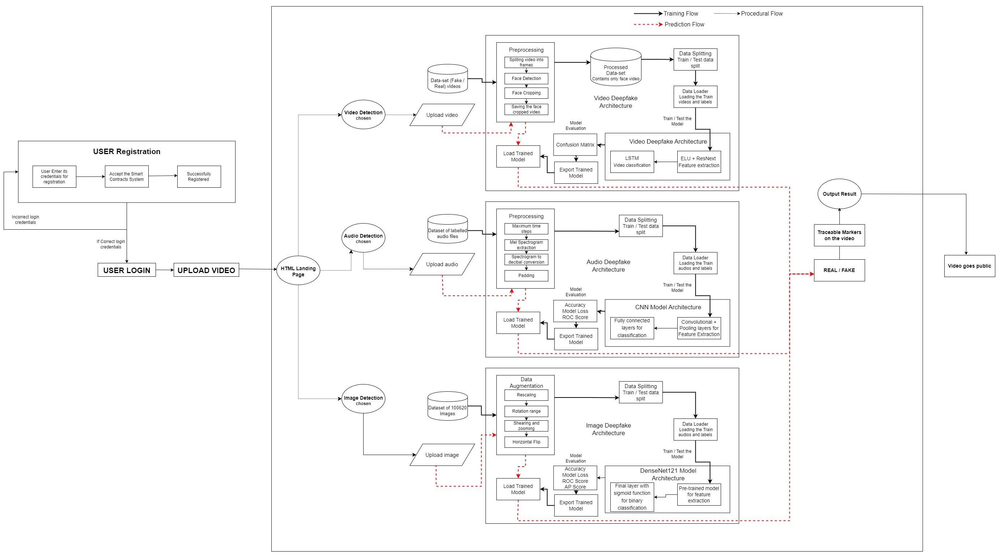

# **Sach-AI** : An End-to-End Novel Framework for Deepfake Detection using Artificial Intelligence and Blockchain

This system is designed keeping in mind about the recent misuse of the Artificial Intelligence in generation of deepfakes. Deep fake is a technique for human image synthesis based on the process of artificial intelligence. Specially, it uses the concept of deep learning. Deep fakes are created by the integration and superimposing of various existing images and videos into that of source Images or videos using various deep-learning techniques available, which are commonly known as generative adversarial networks. 

This system is a fully functional and end-to-end framework for Deepfake Detection System which integrates the video, audio and image in a single platform. This system is fully functional for detecting deepfakes across three formats. The full architecture and working diagram of the system is shown below



**The full architecture is applied for Patent through Office of the Controller General of Patents, Designs and Trade Marks (CGPDTM), Government of India.**

Here, the full architecture works as
 1. User has to **register** through the system with its credentials.
 2. User has to accept the **Smart Contract** which will be having the terms and conditions required for accessing the system.
 3. User has to login with the credentials. Correct credentials will success in login.
 4. Next, the user can upload his/her video.
 5. The video goes through the algorithms as per the format of the file uploaded.
    
    i. For **Video Deepfake Detection**, our state-of-the-art algorithm uses **Eulerian Video Magnification** and **ResNext** for feature Extraction and LSTM for Classification. It gives an accuracy of **97.76%**.
    
    ii. For **Audio Deepfake Detection**, CNN was used for model training which gave an accuracy of **99%.** 
    
    iii. For **Image Deepfake Detection**, **DenseNet121** architecture was used and fine-tuned on a **dataset of 100620 images**. It gave an accuracy of **94.06%.**

6. Next, after all the deepfake detection done in the backend, the result is shown whether the uploaded file is **real or fake.**
7. After this, every **file** goes through the **traceable marking procedure** where a **virtual traceable marker** is placed inside the file. This marker will trigger once in the following conditions:
    
    i. For videos detected as **Fake**, the marker will be triggered whenever the video will be **first shared** by any means. The **details of the owner of the video**, along with the **uploader** will automatically be stored in the **metadata of this marker.**

    ii. For videos detected as **Real**, if the **video is tampered in further time**, and **shared**, the marker will be **triggered** and the same step will be followed as above.

**This marker will be considered as a **checkpoint** whenever the video will be shared as a tampered or deepfaked. Considering this checkpoint, even after millions of shares of the video, the original owner of the video along with the uploader could be traced in real-time.**

N.B.: **The Traceable Marker is not deployed here in this. The full functional deepfake detection is deployed and is ready to be dockerised. The proposed architecture is given after research and studies and is fully implementable.**
## **Steps for Running the Server :** ##


## Running

First place all the models in the models/ folder by downloading from the following link:
https://drive.google.com/drive/folders/1Al_D3xP9GpzsHPSFVUoboU7KPI8o58E4?usp=sharing

### To start the server run

```bash
  1. cd FinalGUI
  
  2. python app.py 
  
  or 
  
  3. python3 app.py
```

This will start the **Flask** server in the localhost (For ex: 127.0.0.1:5000)

## For Video Deepfake Detection

### Dataset Source

    1. https://github.com/yuezunli/celeb-deepfakeforensics

    2. https://www.kaggle.com/c/deepfake-detection-challenge

    3. https://paperswithcode.com/dataset/faceforensics-1

### To Train the Model

```bash
    1. cd VideoDeepfakeDetection

    2. cd ModelCreation

    3. Run all the cells of the file : Model_and_train_csv.ipynb
```

## For Audio Deepfake Detection

### Dataset Source

    1. https://datashare.ed.ac.uk/handle/10283/3336

    Download the LA.zip file from here and place the contents according to the main.ipynb file.

### To Train the Model

```bash
    1. cd AudioDeepfakeDetection

    2. Run all the cells of the file : main.ipynb
``` 

## For Image Deepfake Detection

### Dataset Source

Two datasets from Kaggle were taken and combined together. Since the datasets are too large they are not pushed to the repository. Please download the following datasets:

    1. https://www.kaggle.com/xhlulu/140k-real-and-fake-faces
    2. https://www.kaggle.com/ciplab/real-and-fake-face-detection

Once downloaded create a folder called `combined-real-and-fake-faces/combined-real-vs-fake`. Within this folder should be 3 subfolders: `train`, `valid` and `test`. Combine the second dataset with the first one.

### To Train the Model

```bash
    The notebooks within the specific arch. are indepedent and can be run parallely. Each of these notebooks will save the `.h5` models. Place all the saved models in the folder called `models`. 
```
## Screenshots


## Authors

- [@purvikajoshi01](https://www.github.com/purvikajoshi01)
- [@AyanSar](https://github.com/Ayan-Sar)

